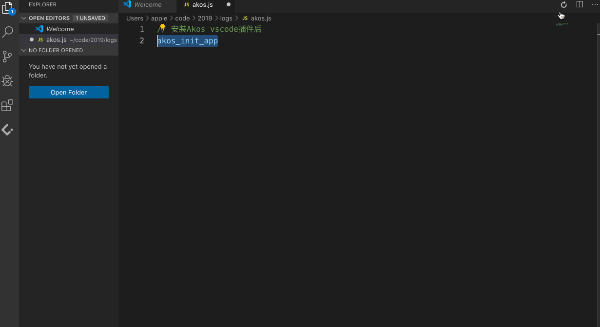
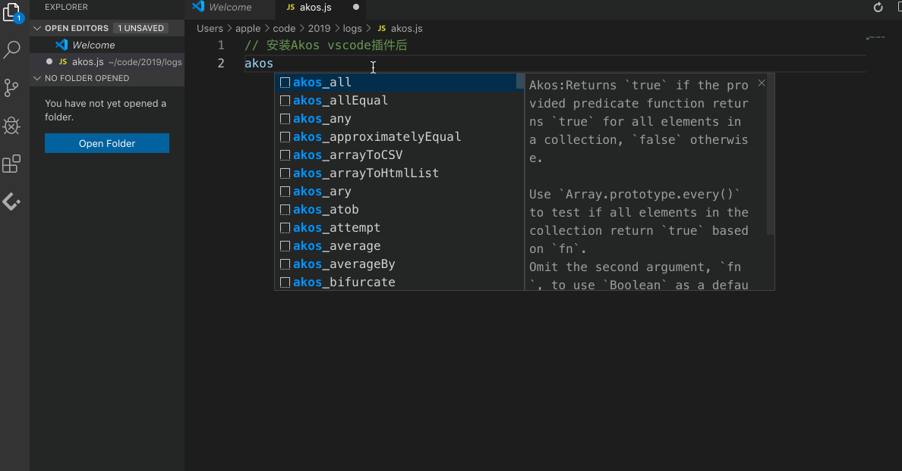
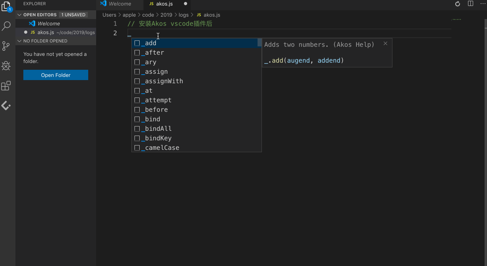

# Akos vscode plugin 

This is the README for your extension "akos". After writing up a brief description, we recommend including the following sections.

## 功能描述
### 一、基于akos模板代码片段使用
模板片段有自身的一套规则逻辑，用于生成akos规范模板代码，仅需对模板代码进行修改即可完成功能，主要用于辅助开发减少不必要的常规代码编写，采用组合型规则，文档待补全.
- akos模板片段使用规则说明[链接]。--待补全文档
- 可使用快捷键ctrl+alt+l(可自定义)或者图标。
使用图标生成模板方式展示如下:


### 二、Akos集成30-seconds代码片段
识别akos_{方法名}为前缀，自动联想代码,可直接当做引入方法使用，使用便捷。方法名使用文档请查看[链接](./assets/doc/method.md).
#### 用法举例: akos_CSVToArray
文档说明
### CSVToArray

Converts a comma-separated values (CSV) string to a 2D array.

Use `Array.prototype.slice()` and `Array.prototype.indexOf('\n')` to remove the first row (title row) if `omitFirstRow` is `true`.
Use `String.prototype.split('\n')` to create a string for each row, then `String.prototype.split(delimiter)` to separate the values in each row.
Omit the second argument, `delimiter`, to use a default delimiter of `,`.
Omit the third argument, `omitFirstRow`, to include the first row (title row) of the CSV string.

```js
const CSVToArray = (data, delimiter = ',', omitFirstRow = false) =>
  data
    .slice(omitFirstRow ? data.indexOf('\n') + 1 : 0)
    .split('\n')
    .map(v => v.split(delimiter));
```

```js
CSVToArray('a,b\nc,d'); // [['a','b'],['c','d']];
CSVToArray('a;b\nc;d', ';'); // [['a','b'],['c','d']];
CSVToArray('col1,col2\na,b\nc,d', ',', true); // [['a','b'],['c','d']];
```
插件使用说明


### 三、Akos集成lodash使用方法
输入"_",进行联想输入,使用说明，待补全
#### 使用展示如下

## Requirements

If you have any requirements or dependencies, add a section describing those and how to install and configure them.

## Extension Settings

Include if your extension adds any VS Code settings through the `contributes.configuration` extension point.

For example:

This extension contributes the following settings:

* `myExtension.enable`: enable/disable this extension
* `myExtension.thing`: set to `blah` to do something

## Known Issues

Calling out known issues can help limit users opening duplicate issues against your extension.

## Release Notes

Users appreciate release notes as you update your extension.

### 1.0.0

Initial release of ...

### 1.0.1

Fixed issue #.

### 1.1.0

Added features X, Y, and Z.

-----------------------------------------------------------------------------------------------------------

## Working with Markdown

**Note:** You can author your README using Visual Studio Code.  Here are some useful editor keyboard shortcuts:

* Split the editor (`Cmd+\` on macOS or `Ctrl+\` on Windows and Linux)
* Toggle preview (`Shift+CMD+V` on macOS or `Shift+Ctrl+V` on Windows and Linux)
* Press `Ctrl+Space` (Windows, Linux) or `Cmd+Space` (macOS) to see a list of Markdown snippets

### For more information

* [Visual Studio Code's Markdown Support](http://code.visualstudio.com/docs/languages/markdown)
* [Markdown Syntax Reference](https://help.github.com/articles/markdown-basics/)

**Enjoy!**
